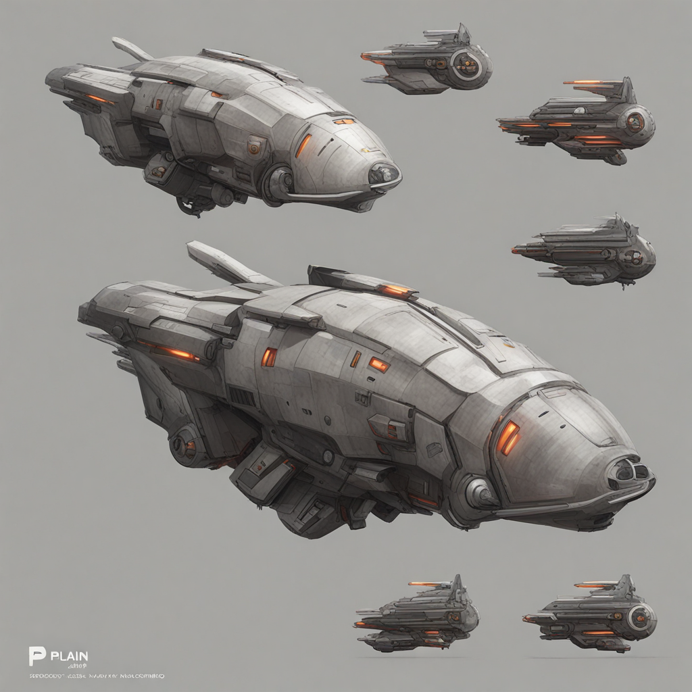

<div align="center">

# 🎨 SDXL API — Turn a prompt (or an image) into game-ready concept art

**Prompt in → images out.** A self-contained, GPU-powered Docker service running
**Stable Diffusion XL** locally: an HTTP API (txt2img + img2img, hot-swappable LoRAs, optional
refiner, one-click background removal) plus a bilingual web UI — built to feed the concept-art
pipeline of [**KOLONEX**](https://kolonex.net), a real-time 4X space-empire strategy game.

[](https://stability.ai/stable-image)
[](https://github.com/huggingface/diffusers)
[](LICENSE)
[](https://kolonex.net)



*A real output from this service — `txt2img`, one prompt, ~9 s.*

*English · [Español ↓](#-español)*

</div>

---

## 🎮 Why this exists

[**KOLONEX**](https://kolonex.net) is a browser-based, real-time **4X space strategy** game — colonize
procedurally-generated 3D planets, build an economy, research tech, forge alliances, wage fleet
warfare. A universe like that runs on a constant stream of art: ships, structures, props, planetary
buildings.

This service is the **front of the asset pipeline**. Type a prompt (or drop a reference image) and
**Stable Diffusion XL** produces concept art in seconds. Ask for a clean subject on a plain
background — or flip on **background removal** — and the result drops straight into its sibling,
[**TRELLIS**](https://github.com/KOLONEX/trellis-api), which turns that 2D image into a textured 3D
`.glb`. **Idea → image → 3D model**, all self-hosted, all offline.

> **⭐ Star this if you build with it — and come [play KOLONEX](https://kolonex.net) (free, early access).**

---

## ✨ Highlights

- 🖼️ **txt2img + img2img** — generate from a prompt, or reinterpret / restyle an input image (denoise-controlled).
- 🎛️ **Hot-swappable LoRAs** — drop `.safetensors` into a mounted folder; they show up in the API and UI instantly, selectable per request with a weight. No rebuild.
- ✨ **Optional SDXL refiner** — a second-stage polish for fine detail, toggleable per request (on by default, off for speed or for TRELLIS-bound images).
- 🪄 **One-click background removal** (rembg) — outputs a clean subject, ready for image→3D.
- 📦 **Baked & offline** — SDXL base + refiner + VAE are inside the image (fp16). Boots with no internet.
- 🌐 **Bilingual web UI** (ES/EN) with inline help on every parameter — same look as the TRELLIS viewer.
- 🎯 **Pin the GPU** — run it on a specific card (`--gpus '"device=1"'`) so it lives alongside TRELLIS on a second GPU.
- 🧪 **Testable without a GPU** — the whole API is covered by tests that run on any laptop via a `FakeBackend`.

---

## 🚀 Quick start

```bash
# build (bakes base + refiner + VAE — fp16, ~19 GB image)
docker build -t sdxl-api ./sdxl-docker

# run on GPU 1, with a LoRA folder + persistent outputs
docker run --gpus '"device=1"' -p 5083:8000 \
  -v "$PWD/loras:/models/loras" -v sdxl-outputs:/outputs sdxl-api
# → open http://localhost:5083
```

Call the API directly:

```bash
# txt2img → JSON with image URLs
curl -s -X POST http://localhost:5083/txt2img -H 'Content-Type: application/json' \
  -d '{"prompt":"a sci-fi cargo spaceship, concept art, plain background","batch":2}'

# img2img → restyle a reference
curl -s -X POST http://localhost:5083/img2img \
  -F prompt="the same ship, battle-damaged" -F denoise=0.5 -F file=@ship.png
```

**Requirements:** NVIDIA GPU with **~20 GB free VRAM** (base + refiner resident), CUDA-12.1-compatible
drivers, and the [NVIDIA Container Toolkit](https://docs.nvidia.com/datacenter/cloud-native/container-toolkit/latest/install-guide.html).

---

## 🧩 API

| Method | Path | Description |
|---|---|---|
| `GET`    | `/`               | bilingual web UI |
| `GET`    | `/health`         | model status + free VRAM |
| `GET`    | `/loras`          | LoRAs discovered in the mounted folder |
| `POST`   | `/txt2img`        | JSON params → 1..N images |
| `POST`   | `/img2img`        | multipart `file` + params → 1..N images |
| `POST`   | `/img2img/json`   | `{ image_base64, ... }` → same |
| `GET`    | `/files/{id}.png` | download an image |
| `DELETE` | `/files/{id}.png` | delete an image |

**Params:** `prompt`, `negative_prompt`, `steps`, `cfg`, `sampler` (`dpmpp_2m`, `dpmpp_sde`, `euler`,
`euler_a`, `ddim`), `width`, `height`, `seed` (0 = random), `batch` (≤ `MAX_BATCH`), `loras`
(`[{name, weight}]`), `use_refiner`, `refiner_switch`, `remove_background`. `img2img` adds `denoise`.

---

## 🏗️ How the image is built & 🧨 the build story

The `Dockerfile` sits on `nvidia/cuda:12.1.1-cudnn8-runtime` — inference only, **no CUDA compilation**,
so the build is plain `pip install` + a model bake. But baking ~13 GB of weights during `docker build`
took some hardening:

| The trap | The fix |
|----------|---------|
| **The HuggingFace download stalled** — 21 minutes of zero output at file 2/57, twice in a row. | Enable **`hf_transfer`** (Rust, parallel-chunked, resumable) and retry on transient errors — the download went from *hung* to *seconds*. |
| **~Doubled data.** `snapshot_download` pulls the whole repo — full-precision **and** fp16 weights — but the pipelines load `variant="fp16"`. | Restrict base/refiner to `**/*.fp16.safetensors` + configs. Halved the download; the VAE (no fp16 suffix) is fetched whole. |
| **Base image pull failed with `401`.** Stale Docker Hub creds were rejected for the anonymous `nvidia/cuda` pull. | `docker logout` before building. |
| **Both base + refiner resident ≈ 20 GB VRAM** on a 24 GB card. | The refiner is an **optional per-request toggle** — off for speed or for TRELLIS-bound images. |

The payoff: a reproducible image that **boots 100 % offline** and generates in seconds.

### 💾 Offline weight cache

Once you have the weights, you never need to download them again. The bake step bind-mounts
the project's `./models` folder and **prefers it over the network**:

```bash
# 1. build once (downloads the weights from HuggingFace)
docker build -t sdxl-api ./sdxl-docker

# 2. save them into ./models  (base + refiner + vae, ~14 GB)
bash sdxl-docker/scripts/export-models.sh

# 3. every later build copies from ./models — no internet, no HuggingFace
docker build -t sdxl-api ./sdxl-docker
```

`scripts/download_models.py` copies from `./models` when the weights are there and falls back
to HuggingFace when they aren't, so a plain `docker build` works either way. `./models` is
git-ignored (~14 GB) — it's a local offline backup, not something you commit.

---

## 🧠 Architecture

SDXL is isolated behind a small `Backend` protocol (`load` / `txt2img` / `img2img`). A
`PipelineManager` wraps it with an `asyncio.Lock` (one GPU job at a time), timing, and PNG
persistence. The API, storage, LoRA registry, and schemas **know nothing about torch or CUDA** — every
heavy import is lazy — so they're tested anywhere with a `FakeBackend`. Only `SdxlBackend` and
`docker build` need a GPU.

```
app/
├── schemas.py    # Pydantic v2 request/response validation
├── storage.py    # traversal-safe job_id → .png persistence
├── loras.py      # discover / validate LoRAs from the mounted volume
├── pipeline.py   # Backend protocol · PipelineManager (mutex) · FakeBackend · SdxlBackend
├── api.py        # create_app factory + endpoints
└── web/          # bilingual (ES/EN) vanilla UI, no build step
```

**Dev tests (no GPU, no torch):**

```bash
cd sdxl-docker
python -m venv .venv && . .venv/Scripts/activate   # bash: source .venv/bin/activate
pip install -r requirements-dev.txt
pytest
```

---

## ⚙️ Configuration

Images are written to `/outputs`; LoRAs are read from `/models/loras`. Mount both.

| Env var | Default | Description |
|---|---|---|
| `OUTPUT_DIR`          | `/outputs`       | where generated PNGs go |
| `LORA_DIR`            | `/models/loras`  | mounted LoRA folder (hot-swappable) |
| `MAX_UPLOAD_MB`       | `10`             | max img2img input size |
| `MAX_BATCH`           | `4`              | max images per request |
| `DEFAULT_USE_REFINER` | `true`           | refiner default when a request omits `use_refiner` |
| `LOCAL_CACHE`         | `/opt/models-cache` | build-time: local weight cache (`./models`) preferred over HuggingFace |
| `CUDA_VISIBLE_DEVICES`| —                | pin the GPU (or use `--gpus '"device=N"'`) |

---

## 📄 License & credits

Released under the [MIT License](LICENSE), part of the [KOLONEX](https://kolonex.net) toolchain.
Built on [Stable Diffusion XL](https://stability.ai/stable-image) via 🤗
[diffusers](https://github.com/huggingface/diffusers); model weights remain subject to their own
licenses. Pairs with [TRELLIS API](https://github.com/KOLONEX/trellis-api) for image→3D.

<div align="center">

### 🎮 [Play KOLONEX — free, in early access →](https://kolonex.net)

</div>

---
---

<a name="-español"></a>

<div align="center">

# 🎨 SDXL API — Convertí un prompt (o una imagen) en concept art para tu juego

**Entra un prompt → salen imágenes.** Un servicio Docker autocontenido y acelerado por GPU que corre
**Stable Diffusion XL** en local: una API HTTP (txt2img + img2img, LoRAs en caliente, refiner opcional,
quita-fondo de un click) más una UI web bilingüe — creado para alimentar el pipeline de arte de
[**KOLONEX**](https://kolonex.net), un juego de estrategia espacial 4X en tiempo real.

*[English ↑](#-sdxl-api--turn-a-prompt-or-an-image-into-game-ready-concept-art) · Español*

</div>

## 🎮 Por qué existe

[**KOLONEX**](https://kolonex.net) es un **4X de estrategia espacial en tiempo real** que corre en el
navegador: colonizá planetas 3D procedurales, desarrollá tu economía, investigá tecnologías, formá
alianzas, peleá con flotas. Un universo así necesita un flujo constante de arte: naves, estructuras,
props, edificios.

Este servicio es el **frente del pipeline de assets**. Escribís un prompt (o soltás una imagen de
referencia) y **Stable Diffusion XL** genera concept art en segundos. Pedile un sujeto limpio sobre
fondo plano —o activá el **quita-fondo**— y el resultado entra directo a su hermano,
[**TRELLIS**](https://github.com/KOLONEX/trellis-api), que convierte esa imagen 2D en un modelo 3D
`.glb` texturizado. **Idea → imagen → modelo 3D**, todo self-hosted, todo offline.

> **⭐ Dale una estrella si construís con esto — y vení a [jugar KOLONEX](https://kolonex.net) (gratis, acceso anticipado).**

## ✨ Lo destacado

- 🖼️ **txt2img + img2img** — generá desde un prompt, o reinterpretá/reestilizá una imagen (con denoise).
- 🎛️ **LoRAs en caliente** — tirás `.safetensors` en una carpeta montada y aparecen al toque en la API y la UI, seleccionables con peso. Sin rebuild.
- ✨ **Refiner de SDXL opcional** — segundo pase que pule el detalle fino, toggle por request (ON por defecto; OFF para velocidad o imágenes que van a TRELLIS).
- 🪄 **Quita-fondo de un click** (rembg) — deja el sujeto limpio, listo para imagen→3D.
- 📦 **Horneado y offline** — base + refiner + VAE de SDXL dentro de la imagen (fp16). Arranca sin internet.
- 🌐 **UI web bilingüe** (ES/EN) con ayuda en cada parámetro — mismo look que el visor de TRELLIS.
- 🎯 **Fijá la GPU** — corré en una placa específica (`--gpus '"device=1"'`) para convivir con TRELLIS en otra GPU.
- 🧪 **Testeable sin GPU** — toda la API se cubre con tests que corren en cualquier laptop vía un `FakeBackend`.

## 🚀 Inicio rápido

```bash
# build (hornea base + refiner + VAE — fp16, imagen ~19 GB)
docker build -t sdxl-api ./sdxl-docker

# correr en GPU 1, con carpeta de LoRAs + outputs persistentes
docker run --gpus '"device=1"' -p 5083:8000 \
  -v "$PWD/loras:/models/loras" -v sdxl-outputs:/outputs sdxl-api
# → abrí http://localhost:5083
```

**Requisitos:** GPU NVIDIA con **~20 GB de VRAM libre** (base + refiner residentes), drivers compatibles
con CUDA 12.1 y el [NVIDIA Container Toolkit](https://docs.nvidia.com/datacenter/cloud-native/container-toolkit/latest/install-guide.html).

## 🧩 API

| Método | Path | Descripción |
|---|---|---|
| `GET`    | `/`               | UI web bilingüe |
| `GET`    | `/health`         | estado del modelo + VRAM libre |
| `GET`    | `/loras`          | LoRAs detectados en la carpeta montada |
| `POST`   | `/txt2img`        | params JSON → 1..N imágenes |
| `POST`   | `/img2img`        | multipart `file` + params → 1..N imágenes |
| `POST`   | `/img2img/json`   | `{ image_base64, ... }` → idem |
| `GET`    | `/files/{id}.png` | descarga |
| `DELETE` | `/files/{id}.png` | borra |

**Params:** `prompt`, `negative_prompt`, `steps`, `cfg`, `sampler`, `width`, `height`, `seed`
(0 = aleatorio), `batch` (≤ `MAX_BATCH`), `loras` (`[{name, weight}]`), `use_refiner`,
`refiner_switch`, `remove_background`. `img2img` suma `denoise`.

## 🧨 La historia del build

Hornear ~13 GB de pesos durante `docker build` costó un poco:

| La trampa | La solución |
|-----------|-------------|
| **La descarga de HuggingFace se colgaba** — 21 min sin salida en el archivo 2/57, dos veces seguidas. | **`hf_transfer`** (Rust, chunks paralelos, resumible) + reintentos → de *colgada* a *segundos*. |
| **~Doble de datos.** `snapshot_download` baja el repo entero — pesos full-precision **y** fp16 — pero los pipelines cargan `variant="fp16"`. | Restringir base/refiner a `**/*.fp16.safetensors` + configs. Mitad de descarga; el VAE (sin sufijo fp16) se baja completo. |
| **El pull de la imagen base fallaba con `401`** por credenciales viejas de Docker Hub. | `docker logout` antes de buildear. |
| **base + refiner residentes ≈ 20 GB de VRAM** en una placa de 24 GB. | El refiner es un **toggle opcional por request** — OFF para velocidad o imágenes que van a TRELLIS. |

### 💾 Cache offline de pesos

Una vez que tenés los pesos, no los descargás nunca más. El paso de horneado monta la carpeta
`./models` del proyecto y **la prefiere por sobre la red**:

```bash
# 1. build una vez (baja los pesos de HuggingFace)
docker build -t sdxl-api ./sdxl-docker

# 2. guardalos en ./models  (base + refiner + vae, ~14 GB)
bash sdxl-docker/scripts/export-models.sh

# 3. cada build posterior copia desde ./models — sin internet, sin HuggingFace
docker build -t sdxl-api ./sdxl-docker
```

`scripts/download_models.py` copia desde `./models` cuando los pesos están ahí y cae a
HuggingFace cuando no, así que un `docker build` normal funciona en ambos casos. `./models` está
git-ignoreada (~14 GB) — es un respaldo offline local, no algo que se commitee.

## 🧠 Arquitectura

SDXL queda aislado tras un `Backend` protocol (`load` / `txt2img` / `img2img`). Un `PipelineManager` lo
envuelve con un `asyncio.Lock` (un job de GPU a la vez), timing y persistencia PNG. La API, storage,
registro de LoRAs y schemas **no conocen torch ni CUDA** (todos los imports pesados son lazy), así que
se testean en cualquier lado con un `FakeBackend`. Solo `SdxlBackend` y `docker build` requieren GPU.

```
app/
├── schemas.py    # validación Pydantic v2
├── storage.py    # job_id anti-traversal → persistencia .png
├── loras.py      # descubre / valida LoRAs del volumen montado
├── pipeline.py   # Backend protocol · PipelineManager (mutex) · FakeBackend · SdxlBackend
├── api.py        # factory create_app + endpoints
└── web/          # UI vanilla bilingüe (ES/EN), sin build
```

## 📄 Licencia y créditos

Publicado bajo [Licencia MIT](LICENSE), parte del toolchain de [KOLONEX](https://kolonex.net).
Construido sobre [Stable Diffusion XL](https://stability.ai/stable-image) vía 🤗
[diffusers](https://github.com/huggingface/diffusers); los pesos siguen sujetos a sus licencias.
Hace pareja con [TRELLIS API](https://github.com/KOLONEX/trellis-api) para imagen→3D.

<div align="center">

### 🎮 [Jugá KOLONEX — gratis, en acceso anticipado →](https://kolonex.net)

</div>
